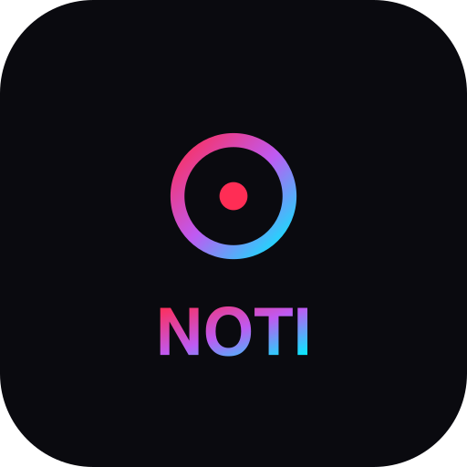

<p align="center">
  
</p>

<h1 align="center">NotiGym</h1>

<p align="center">
  <strong>Track your gains</strong> — Application web de suivi sportif, nutrition et communauté.
</p>

<p align="center">
  <a href="https://notigym.cyberdev-it.com">
    
  </a>
  
  
</p>

---

## A propos

NotiGym est une **Progressive Web App** pensée pour les pratiquants de musculation et de street workout. Elle remplace carnet, chronomètre, appli nutrition et tableur Excel par une seule interface fluide, installable sur mobile et utilisable hors ligne.

Le projet est né d'un besoin personnel : un outil tout-en-un, rapide, bilingue (FR/EN), avec un vrai système de progression — pas juste un compteur de séries.

---

## Fonctionnalités

| Domaine | Ce que ça fait |
|---------|---------------|
| **Entraînements** | Programmes personnalisés, séances en temps réel, supersets, timer auto-repos, surcharge progressive (+2.5%), warmup |
| **Records** | Détection automatique des PRs (formule Epley), mur des records avec graphe 1RM |
| **Programmes** | 78 programmes Madbarz pré-chargés, création libre, import de templates |
| **Nutrition** | Journal alimentaire, recherche OpenFoodFacts, scanner code-barres, objectifs macros, suivi d'eau |
| **Recettes** | 157 recettes complètes avec ingrédients, étapes et macros |
| **Corps** | Pesées, mensurations, photos de progression, timelapse corporel animé |
| **Communauté** | Fil d'actualité, likes, commentaires, partage de séances et records |
| **Succès** | 18 badges à débloquer, compteur de streaks |
| **Planning** | Planning hebdomadaire drag & drop |
| **Statistiques** | Graphiques interactifs (volume, fréquence, durée, progression) |
| **Notifications** | In-app + Web Push sur mobile |
| **Export** | Export de séance en image partageable |
| **Comparaison** | Compare deux séances côte à côte |
| **Objectifs** | Cible séances/semaine avec barre de progression |
| **2FA** | Authentification à deux facteurs (TOTP + backup codes) |
| **i18n** | Français + Anglais, choix au premier lancement |
| **PWA** | Installable, fonctionne hors ligne, thème auto (clair/sombre) |

---

## Stack technique

```
Frontend       React 18 · TypeScript · Vite · Tailwind CSS · Zustand · Recharts · Framer Motion
Backend        Python · FastAPI · SQLAlchemy 2.0 (async) · Pydantic v2
Base de données PostgreSQL 16
Auth           JWT HttpOnly cookies (access + refresh) · 2FA TOTP · Rate limiting (slowapi)
Infra          Docker Compose · Nginx · Cloudflare Tunnel · GitHub Actions CI
PWA            vite-plugin-pwa · Workbox · Web Push (VAPID)
```

---

## Démarrage rapide

### Prérequis

- [Docker](https://docs.docker.com/get-docker/) + Docker Compose
- (macOS) [Colima](https://github.com/abiosoft/colima) ou Docker Desktop

### Lancement

```bash
git clone https://github.com/Espalgui/notigym.git
cd notigym
cp .env.example .env   # Configurer les variables si besoin

docker compose up --build
```

| Service | URL |
|---------|-----|
| Frontend | http://localhost:5173 |
| API Docs | http://localhost:8000/docs |

---

## Architecture

```
notigym/
├── api/                        # Backend FastAPI
│   ├── app/
│   │   ├── auth/               # JWT + dépendances d'auth
│   │   ├── models/             # SQLAlchemy (users, workouts, nutrition, community…)
│   │   ├── schemas/            # Pydantic validation
│   │   ├── routers/            # Endpoints REST (auth, workouts, nutrition, body…)
│   │   ├── services/           # Logique métier (PR detection, achievements, push)
│   │   ├── seed.py             # 254 exercices pré-chargés
│   │   ├── seed_recipes.py     # 157 recettes pré-chargées
│   │   └── main.py             # Point d'entrée
│   ├── Dockerfile / Dockerfile.prod
│   └── requirements.txt
│
├── frontend/                   # React SPA
│   ├── src/
│   │   ├── pages/              # 18 pages (lazy-loaded)
│   │   ├── components/         # UI réutilisables
│   │   ├── stores/             # Zustand (auth, theme)
│   │   ├── hooks/              # Custom hooks (push notifications…)
│   │   ├── lib/                # API client, utils, i18n
│   │   └── locales/            # Traductions FR + EN
│   ├── public/                 # PWA assets + offline.html
│   ├── Dockerfile / Dockerfile.prod
│   └── vite.config.ts
│
├── nginx/                      # Reverse proxy (prod)
├── migrations/                 # SQL migrations
├── .github/workflows/ci.yml   # CI : lint + build
├── docker-compose.yml          # Dev (hot-reload)
└── docker-compose.prod.yml     # Prod (Nginx + Cloudflare Tunnel)
```

---

## API

<details>
<summary><strong>Endpoints principaux</strong></summary>

| Méthode | Route | Description |
|---------|-------|-------------|
| `POST` | `/api/auth/register` | Inscription |
| `POST` | `/api/auth/login` | Connexion (JWT + 2FA) |
| `GET` | `/api/users/me` | Profil courant |
| `CRUD` | `/api/workouts/programs` | Programmes d'entraînement |
| `CRUD` | `/api/workouts/sessions` | Séances + sets |
| `GET` | `/api/workouts/sessions/compare` | Comparaison de séances |
| `GET` | `/api/workouts/stats` | Statistiques globales |
| `GET` | `/api/workouts/records` | Records personnels |
| `CRUD` | `/api/nutrition/entries` | Journal alimentaire |
| `GET` | `/api/nutrition/summary` | Résumé du jour |
| `GET` | `/api/nutrition/product/{barcode}` | Recherche OpenFoodFacts |
| `CRUD` | `/api/body/measurements` | Mensurations |
| `CRUD` | `/api/body/photos` | Photos de progression |
| `GET` | `/api/community/feed` | Fil d'actualité |
| `GET` | `/api/achievements` | Succès et badges |
| `GET` | `/api/exercises` | 254 exercices (FR/EN) |
| `CRUD` | `/api/recipes` | 157 recettes |
| `POST` | `/api/notifications/push/subscribe` | Web Push |

Documentation interactive complète : **`/docs`** (Swagger UI)

</details>

---

## Déploiement production

```bash
# Sur le serveur
docker compose -f docker-compose.prod.yml up --build -d
docker compose -f docker-compose.prod.yml restart nginx
```

L'application est servie via **Nginx** en reverse proxy, exposée sur Internet par **Cloudflare Tunnel** (zero-trust, pas de port ouvert).

---

## Licence

Projet personnel — tous droits réservés.

---

<p align="center">
  Made with <strong>FastAPI</strong> + <strong>React</strong> by <a href="https://github.com/Espalgui">@Espalgui</a>
</p>
